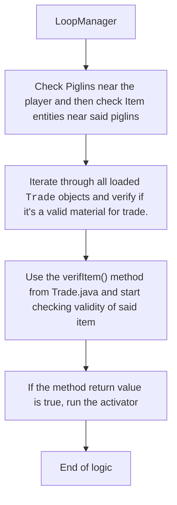

# How To Process Custom Piglin Trades

Classes:
- `com.ssomar.custompiglinstrades.events.LoopManager`
- `com.ssomar.custompiglinstrades.trades.Trade`

```mermaid
flowchart TD
    loopManager["LoopManager"]
    --> checkItemNearPiglin["Check Piglins near the player and then check Item entities near said piglins"]
    --> TradesManager["Iterate through all loaded <code>Trade</code> objects and verify if it's a valid material for trade."]
    --> verifItem["Use the verifItem() method from Trade.java and start checking validity of said item"]
    --> runActivator["If the method return value is true, run the activator"]
    --> ending["End of logic"]
```