# Processing Crafting Recipes

## Evaluating Valid Crafting Table Recipes
Classes:
- `vayk.executablecrafting.events.CraftingTableListener`
- `vayk.executablecrafting.customRecipes.RecipeManager`
- `vayk.executablecrafting.customRecipes.types.RecipeCrafting`

```mermaid
flowchart LR

    subgraph CraftingTableListener
        style CTL_onPrepareCraft fill:#2d6a2d,stroke:#4CAF50,color:#fff
        style RM_isValidGrid fill:#2D4D3D
        CTL_onPrepareCraft(["onPrepareCraft()"])
        CTL_prepareCraft["prepareCraft()"]

        CTL_prepareCraft -- "Iterate through each recipe in getCraftingRecipes()" --> RecipeManager
        subgraph RecipeManager
            RM_recipe["RecipeCrafting obj"]
            RM_recipe --> RM_isValidGrid["run isValidGrid() method to try get the max craft for this recipe<hr/>Click here to go to the flowchart of this logic"] -- "If max craft is not 0" --> RM_ifValid
            RM_ifValid["Store recipe details in a variable, get the result of the recipe and end the iteration"]
            click RM_isValidGrid "#isvalidgrid"
        end

        style CTL_noValidCustomRecipe fill:#f00,stroke:#783434,color:#fff
        
        RecipeManager -- "if the pattern in the crafting table matches no custom recipe in EC's recipes folder" --> CTL_noValidCustomRecipe
        RecipeManager -- "if the conditions of the recipe aren't met (ex: Player Conditions, Block Conditions)" --> CTL_noValidCustomRecipe
        CTL_noValidCustomRecipe(["return / end"])

        RecipeManager -- "if the pattern is valid and conditions are fulfilled" --> CTL_setResult

        CTL_setResult["inventory.setResult()"]

        CTL_setResult --> done
        style done fill:#236782,stroke:#0B4054,color:#fff
        done(["proper end of method"])

        CTL_onPrepareCraft --> CTL_prepareCraft
    end
```

## isValidGrid()

```mermaid
flowchart LR
    subgraph RecipeCrafting

        style return1 fill:#f00,stroke:#783434,color:#fff
        return1(["return 0"])
        style return2 fill:#f00,stroke:#783434,color:#fff
        return2(["return 0"])

        style start fill:#2d6a2d,stroke:#4CAF50,color:#fff
        start(["isValidGrid()"]) -->
        getShapeless["Get shapeless status for evaluation"] -->
        setupIdealItemsArray["Getting the itemstack details of each slot of the recipe (The input1, input2, ... from the recipe's yml)"]

        setupIdealItemsArray -->
        ifGrid2x2{"if grid is 2x2"} -- "if recipe is 2x2 or smaller" -->
        remapRecipeTo2x2["Remap the array into a 4-item array for later 2x2 recipe evaluation"]

        ifGrid2x2 -- "if recipe is bigger than 2x2" --> return1

        setupIdealItemsArray --> ifAllInputsEmpty
        remapRecipeTo2x2 --> ifAllInputsEmpty
        ifAllInputsEmpty{"If all inputs are empty"}

        ifAllInputsEmpty -- "true" --> return2

        %% =================
        %% =================

        ifAllInputsEmpty -- "false" --> IfShapeless["if Shapeless <hr/>Click here to go to the flowchart of this logic"]
        ifAllInputsEmpty -- "false" --> IfShaped
        subgraph IfShaped
        end
        click IfShapeless "#shapeless"
        style IfShapeless fill:#2D4D3D


    end
```

### Shapeless
Classes:
- `vayk.executablecrafting.customRecipes.Recipe`
- `com.ssomar.score.features.custom.itemcheckers.ItemCheckerEnum`
- `com.ssomar.score.features.custom.itemcheckers.ItemCheckers`

#### Phase 1 — Setup

```mermaid
flowchart LR
    style IfShapeless fill:#3B3131
        subgraph IfShapeless
            
            putItemsToHashmap["Put the required recipe items to a hashmap"] -->
            putCurrentTableItemsToHashmap["Put the ItemStacks present in the crafting table to a hashmap"]

            putCurrentTableItemsToHashmap -- "if there's a mismatch to the amount of slots filled between the recipe's requirements and current items in the crafting table" --> return3
            style return3 fill:#f00,stroke:#783434,color:#fff
            return3(["return 0"])

            putCurrentTableItemsToHashmap -->
            sortMapByAmountOfItems["Sort both Hashmaps based on the ItemStack .getAmount() value in descending order"] -->
            iterateThroughRequiredItems["Iterate through each entry in the Hashmap (Each required item that occupies a slot in the shapeless crafting recipe) using <br/><hr/><code>for (Map.Entry<Integer, RecipeInput> hash : hashMapNeededItemsSortedMap.sequencedEntrySet()) {</code><hr/>And then start iterating through the ItemStacks present in the crafting table Hashmap<hr/><code>for (int i = 0; i < craftingGrid.length; i++) {</code>"] 
            
        end
```

#### Phase 2 — Slot Evaluation

```mermaid
flowchart LR
    style Iteration fill:#31313B
        subgraph Iteration
            usedSlot["If usedSlots doesn't contain the currently evaluated grid slot number"] -->
            ifNotNullOrAir["If the currently evaluated slot is not null or air"] --> Recipe

            style Recipe fill:#2E332E
            subgraph Recipe
                verifyItemsSimilarity["verifyItemsSimilarity
                (neededInput, gridItem)"] -->
                getRecipeAssociations["Get recipe groups that are associated to this recipe"] --> 
                IsSimilar["Run RecipeGroup.verifyItemsSimilarity() which runs ItemCheckers.isSimilar(). This section will run the logic
                based on the ItemCheckerType value, where ITEM_MUST_BE_EXACTLY_THE_SAME and CUSTOM_CHECKS are located.<br/>
                Each custom checks have their own logic. You can check more details at ItemCheckerEnum.check()<br/>
                So if you're interested in checking the logic of 'Check Amount', 'Check Display Name', 'Check Material', 'Check Custom Model Data', 'Check Lore', 'Check Durability', 'Check Executable Item ID', 'Check Executable Item Usage', 'Check Executable Item Variables', this is the place."]
                IsSimilar -- "return true/false result" --> verifyItemsSimilarity


 
            end

            Recipe -- "If input and grid item are similar" --> 
            getInfosAboutItems["Get needed amount and the amount in the crafting grid"]

            getInfosAboutItems -- "if matchIndex is -1 and item amount in the currently evaluated crafting grid slot is equal or more than the required amount" --> setBestPosAndMaxCraft

            setBestPosAndMaxCraft["Set matchIndex to the currently iterated index so the next items in the list would not evaluate this specific ItemStack in the crafting grid Hashmap and try estimate the max craft possible based on the amount of items found in this iteration of the crafting grid Hashmap"]
            -->
            matchNotFound{"If after iterating through all of the items in the crafting grid hashmap and still found no match"}

            matchNotFound -- "true" --> return4
            style return4 fill:#f00,stroke:#783434,color:#fff
            return4(["return 0"])

            matchNotFound -- "false" --> addToUsedSlots["Add matchIndex value to usedSlots so when the next item in the recipe hashmap tries to evaluate the crafting grid hashmap, it will ignore the item in the crafting grid hashmap that has already been evaluated"]
        end
```

:::info verifyItemsSimilarity — Checks performed
Based on `ItemCheckerType`, the following checks can be applied:
- **ITEM_MUST_BE_EXACTLY_THE_SAME**
- **CUSTOM_CHECKS**: Amount, Display Name, Material, Custom Model Data, Lore, Durability, EI ID, EI Usage, EI Variables

See `ItemCheckerEnum.check()` for full logic.
:::
#### Phase 3 — Max Craftable Submission
- After the logic in shaped or shapeless crafting is done, `.isValidGrid()` will return the max quantity you can produce based on the items in the crafting table. If it's zero, it will show nothing in the result section of the crafting table.
