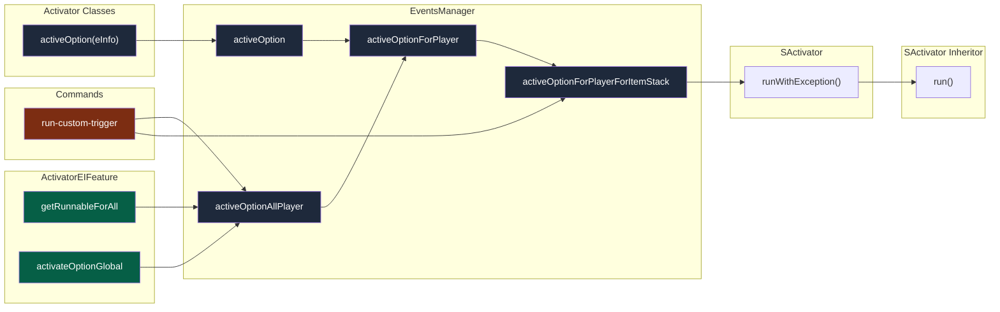

# ⚙ Processing Activator Triggers

This page is dedicated into helping you on where to look and to have a deeper understanding how ItemStacks and Events make
up an ExecutableItem Activator.

## Classes involved in ExecutableItems project:
- `EventsManager#activeOptionForPlayerForItemStack` 
  - `com.ssomar.executableitems.listeners.EventsManager#activeOptionForPlayerForItemStack`
  - Activator options are present here to decide whether to execute the activator or not:
    - mustBeAProjectileLaunchWithTheSameEI
- `EventsManager#activeOptionForPlayer`
  - `com.ssomar.executableitems.listeners.EventsManager#activeOptionForPlayer`
- `EventsManager#activeOptionAllPlayer`
  - `com.ssomar.executableitems.listeners.EventsManager#activeOptionAllPlayer`
- `EventsManager#activeOption`
  - `com.ssomar.executableitems.listeners.EventsManager#activeOption`
- `run-custom-trigger command`
  - `com/ssomar/executableitems/commands/CommandsClass.java:506`
  - Custom command that executes the `CUSTOM_TRIGGER` activator
- `ActivatorEIFeature#getRunnableForAll`
  - `com.ssomar.executableitems.executableitems.activators.ActivatorEIFeature#getRunnableForAll`
- `ActivatorEIFeature#activateOptionGlobal`
  - `com.ssomar.executableitems.executableitems.activators.ActivatorEIFeature#activateOptionGlobal`
- `activeOption(eInfo)`
  - Found executed last on almost every class that extends the `Listener` class at package `com.ssomar.executableitems.listeners`.



Reference: `com/ssomar/executableitems/listeners/EventsManager.java:233`

<hr/>
Once all required checks across options are evaluated, `activator.runWithException(ei, updateEInfo);` is executed. 
If you're looking for the other checks such as `max use per day`, `detailed click`, the parsing of placeholders and `update item`/`refresh item` functions, visit the specific `run()`
method mentioned below. 

<details>
<summary>Detailed explanation on the rest of the code flow:</summary>

`runWithException` is a method from the abstract class `SActivator`.  
-> Class: `com.ssomar.score.features.custom.activators.activator.SActivator`

If you go back to the `activeOptionForPlayerForItemStack` method in `EventsManager` class, the for loop iterates `SActivator` objects from `config.getActivators().getActivators()`.
Somewhere in the code, the `SActivator` objects are initialized as its child class (`ActivatorEIFeature`)  
-> Class: `com.ssomar.executableitems.executableitems.activators.ActivatorEIFeature`

With that context in mind, the code snippet below will run `run(parentObject, eventInfo)` as `com.ssomar.executableitems.executableitems.activators.ActivatorEIFeature#run` specifically.

<hr/>
Method: `com.ssomar.score.features.custom.activators.activator.SActivator#runWithException`  
Code Snippet:
```java
public void runWithException(Object parentObject, EventInfo eventInfo) {
      try {
          try {
              run(parentObject, eventInfo);
          } catch (Exception e) {
              throw new SActivatorException("Error while running the activator: " + this.id + " associated with the parent object " + getParentObjectId(), e);
          }
      }catch (SActivatorException e) {
          e.printStackTrace();
      }
  }
```


</details>

<hr/>

Class: `com.ssomar.executableitems.executableitems.activators.ActivatorEIFeature`

<br/><br/>
<hr/>

## (Optional for reader) What even is getting passed to runWithException() ?

Method: `com.ssomar.score.features.custom.activators.activator.SActivator#runWithException`

Parent Object: `com.ssomar.executableitems.executableitems.ExecutableItemObject`
EventInfo: 

## Flowchart for ActivatorEIFeature
Classes:
- `com.ssomar.executableitems.executableitems.activators.ActivatorEIFeature`
- `com.ssomar.score.utils.placeholders.StringPlaceholder`
- `com.ssomar.score.commands.runnable.ActionInfo`
- `com.ssomar.score.features.custom.cooldowns.CooldownFeature`

```mermaid
flowchart TD
  subgraph ActivatorEIFeature
    start(["run()"])
    AEI_getEI["Typecast Object to (ExecutableItemObject)"]
    AEI_TRY_mainhand["Check if slot should me mainhand"]
    AEI_TRY_respawndeath["Check triggered activator and death state of player (For PLAYER_DEATH and PLAYER_RESPAWN)"]
    AEI_TRY_noRunIfCancelled["Check if noActivatorRunIfTheEventIsCancelled is enabled and the event source is cancelled"]

    AEI_TRY_slot["If event info requires mainhand, check if detailed slots has it enabled (isMainHand())"]
    AEI_TRY_perm["Check if the player that executed the activator has permission to use the item"]
    AEI_TRY_owner["Check if the player that executed is the owner if the item deamnds it to"]
    AEI_TRY_usePerDay["Check if the player still has uses left for today"]

    AEI_plch["And other conditions. too tired to list them for now"]

    AEI_cooldown["Add cooldown"]
  end

  subgraph StringPlaceholder
    SP_getInfo["Get block, material, entity, target player infos, usage, usage limit, 
    ei id, item name, item material, durability, activator id, activator name, 
    activator type, max use per day item, max use per day activator, block face, 
    projectile used for execution, item variables, item owner, bow force, custom placeholders from
    source activator, and effect details from PLAYER_RECEIVE_EFFECT activator for later replacement"]
  end

  subgraph ActionInfo
    ACI_setVals["Saves details of activation slot, ExecutableItem object, detailed blocks, event from custom break command
     (ex: if it's from MINEINCUBE, value is true), break cause, silence output, launcher, receiver, velocity, type of event
     that's related to hitting/damaging something for later use"]
  end

  subgraph CooldownFeature
    CDF_addCooldown["Check if player has nocd perm or not and check if cooldown value is not 0"]
    subgraph Cooldown
      CD_setPause["Check if cooldown should pause if player is offline and get the placeholder conditions for it"]
    end
    subgraph CooldownsManager
      CDM_add["Add cooldown to cooldown manager"]
    end
    CDF_setCooldown["Set item cooldown for item and player"]
  end

  start --> AEI_getEI
  AEI_getEI --> AEI_TRY_mainhand
  AEI_TRY_mainhand --> AEI_TRY_respawndeath
  AEI_TRY_respawndeath --> AEI_TRY_noRunIfCancelled
  AEI_TRY_noRunIfCancelled -- "initialization" --> StringPlaceholder
  SP_getInfo -- "initialization" --> ACI_setVals
  ACI_setVals --> AEI_TRY_slot
  AEI_TRY_slot --> AEI_TRY_perm
  AEI_TRY_perm --> AEI_TRY_owner
  AEI_TRY_owner --> AEI_TRY_usePerDay
  AEI_TRY_usePerDay --> AEI_plch

  AEI_plch --> AEI_cooldown --> CDF_addCooldown -- "initialization" --> Cooldown --> CDM_add -- "check if game is 1.21+ and visual cooldown is enabled" --> CDF_setCooldown 
  AEI_cooldown --> tobecontinued











```
