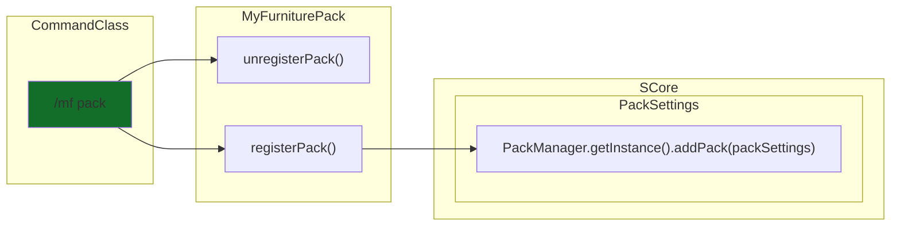

# CMD: mf pack

Classes:
- com.ssomar.myfurniture.commands.CommandsClass
- com.ssomar.myfurniture.pack.MyFurniturePack
- com.ssomar.score.pack.custom.PackSettings

```mermaid
flowchart LR
    
subgraph CommandClass 
    CMD_mf-pack["/mf pack"]
end

subgraph MyFurniturePack 
    MF_UnregisterPack["unregisterPack()"]
    MF_RegisterPack["registerPack()"]
end

subgraph SCore
    subgraph PackSettings
        PackSettings_addPack["PackManager.getInstance().addPack(packSettings)"]
            
    end
        
end


CMD_mf-pack --> MF_UnregisterPack
CMD_mf-pack --> MF_RegisterPack

MF_RegisterPack --> PackSettings_addPack


classDef start fill:#136E2A

class CMD_mf-pack start
```