# MyFurniture Plugin Start Process

This page aims to guide developers on the code flow of MyFunriture when starting.  
Written by Special70 at April 9, 2026. Any major changes onwards may not be present

Class: `com.ssomar.myfurniture.MyFurniture`

## Flowchart

### onLoad() and onEnable()

```mermaid
flowchart TD
    subgraph MyFurniture 
        start(["onLoad()"])
        loadPacketEvents["Load PacketEvents"]
        enable(["onEnable()"])
        isPackFolderExists["Create pack folder if missing"]
        finish(["Finish running onEnable()"])
    end
    
    start --> loadPacketEvents
    loadPacketEvents --> enable
    enable --> isPackFolderExists
    isPackFolderExists --> finish
    
    click enable href "#descriptions"
    click isPackFolderExists href "#create-pack-folder-if-missing"
    
    classDef clickable fill:#264529
    
    class enable,isPackFolderExists clickable
```

### Pack Folder Creation
Continuation of `Create pack folder if missing`

```mermaid
flowchart TD
    subgraph MyFurniture 
        start["new TexturesPackLoader().runPackCommand(new String[0]);"]
        check_if1v21v4{"Is server 1.21.4+"}
    end
    
    subgraph TexturePackLoader
        subgraph 1.21.4
            runCMData["runPackCommandCustomModelData(args);"]
        end
        subgraph +1.21.4 
            fixOldPath["Fix old path"]
            fixPackFile["Fix pack file"]
            readAssetFolder["Read asset folder
            and iterate through it"]
            ifContainsImport{"if 
            containsImport"}
            generateItemsModelFile["generatedItemsModel
            FileForModelThatDidntHave"]
            loadModelsOfNamespace["loadModelsOfNamespace"]
        end
            
    end
    
    start --> check_if1v21v4
    
    check_if1v21v4 -- "&nbsp;No&nbsp;" --> runCMData
    
    
    
    check_if1v21v4 -- "&nbsp;Yes&nbsp;" --> fixOldPath
    fixOldPath --> fixPackFile
    fixPackFile --> readAssetFolder
    readAssetFolder --> ifContainsImport
    
    ifContainsImport -- "&nbsp;Yes&nbsp;" --> generateItemsModelFile
    
    readAssetFolder --> loadModelsOfNamespace

    classDef clickable fill:#264529
    
    class generateItemsModelFile,loadModelsOfNamespace clickable
    
    click generateItemsModelFile href "#generateitemsmodelfile"
    click loadModelsOfNamespace href "#loadmodelofnamespace"
```

## Descriptions

### onEnable()
- Enables BStats metrics to get data on usage of plugin (also considers if the plugin is a free or premium version)
- `TESTEVENT.startUpdate()` (NEEDS CLARIFICATION)
- Loads `PlayerSettingsLoader`, `EventsHandler`, `GeneralConfig`
- Generate animation assets from .bbmodel files (before pack build)
- Loads `FurnitureLoader`, `FurniturePlacedManager`, `StorageEntityManager`
- Loads plugin commands
- Runs `MyFurniturePostLoadEvent()` event for checking if MyFurniture is done

### Create pack folder if missing
- Uses the TexturePackLoader.isPackFolderExists() to check if the pack folder is present (`__textures__` directory)
- Inject GUI textures into the pack — invalidates cache if new files were written

## Class Definitions & References

### generateItemsModelFile
- com.ssomar.myfurniture.texturesloader.TexturesPackLoader#generatedItemsModelFileForModelThatDidntHave

### loadModelOfNamespace
This method is responsible for registering models and creating the furniture's ExecutableItems counterpart
- com.ssomar.myfurniture.texturesloader.TexturesPackLoader#loadModelsOfNamespace