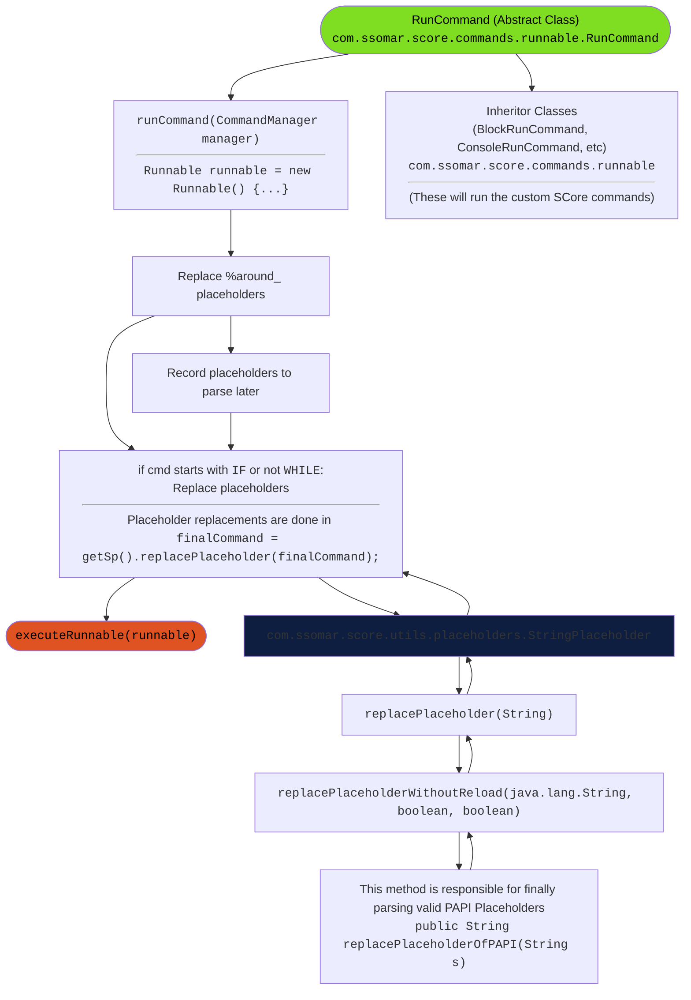

# Command Executions

:::info
This flowchart will help you on where to look if you want to debug the code flow of when a command
is being executed.
:::

```mermaid
---
config:
  flowchart:
    htmlLabels: true
---
flowchart TD
    start(["
RunCommand (Abstract Class)
<code>com.ssomar.score.commands.runnable.RunCommand</code>
    "])

    step01["
<code>runCommand(CommandManager manager)</code>
<hr/><code>Runnable runnable = new Runnable() {...}</code>

    "]

    branchoff["
Inheritor Classes
(BlockRunCommand, ConsoleRunCommand, etc)
<code>com.ssomar.score.commands.runnable</code>
<hr/>(These will run the custom SCore commands)
    "]

    ending(["<code>executeRunnable(runnable)</code>"])

    step02["
Replace %around_ placeholders
    "]
    step02.1["
Record placeholders to parse later
    "]


    step03["
if cmd starts with <code>IF</code> or not <code>WHILE</code>:
Replace placeholders
<hr/>Placeholder replacements are done in <code>finalCommand = getSp().replacePlaceholder(finalCommand);</code>
    "]

    stringPlch["<code>com.ssomar.score.utils.placeholders.StringPlaceholder</code>"]
    stringPlch-00["<code>replacePlaceholder(String)</code>"]
    stringPlch-01["<code>replacePlaceholderWithoutReload(java.lang.String, boolean, boolean)</code>"]
    stringPlch-02["This method is responsible for finally parsing valid PAPI Placeholders
    <code>public String replacePlaceholderOfPAPI(String s)</code>"]

    style start fill:#7FDE21,color:#000000
    style ending fill:#DE5321,color:#000000
    style stringPlch fill:#0E1E40

    start --> branchoff
    start --> step01

    step01 --> step02
    step02 --> step02.1
    step02 --> step03
    step02.1 --> step03

    step03 --> stringPlch
    stringPlch --> step03

    stringPlch --> stringPlch-00
    stringPlch-00 --> stringPlch
    stringPlch-00 --> stringPlch-01
    stringPlch-01 --> stringPlch-00
    stringPlch-01 --> stringPlch-02
    stringPlch-02 --> stringPlch-01

    step03 --> ending


```