# Opening Editor via /ei show

## Main Logic

This page is made because I have no clue how the EI Editor gets its ui formed

References:
- `com.ssomar.executableitems.commands.CommandsClass`
- `com.ssomar.score.sobject.menu.NewSObjectsManagerEditor`
- `com.ssomar.executableitems.editor.ExecutableItemsEditor`
- `com.ssomar.score.menu.GUI`
- `com.ssomar.score.editor.SaveSessionPathManager`
- `com.ssomar.score.sobject.menu.SObjectsEditorAbstract`

```mermaid
flowchart TD
    subgraph EI_CommandClass
        start(["/ei show"])
    end

    runGetInstancesFirst["run getInstance() of ExecutableItemsManager and ExecutableItemLoader"]

    subgraph ExecutableItemsEditor
        constructorEIEditor["super(plugin, EXECUTABLEITEM,#quot;/items#quot;, manager, loader)"]
    end

    subgraph SObjectsEditorAbstract
        superMethodSObjectsEditorAbstract["super(settings, 45)"]
    end

    subgraph GUI
        GUIConstructor["Save settings, titleString, subSettings then run initInventory()"]
        initInventory["Form the GUI inventory and its contents"]
        runSync["Run player.openInventory(inv) on main thread"]
        GUIConstructor --> initInventory
    end

    subgraph SObjectsWithFileEditor
        superSObjectsFileEditor["super(sPlugin, settings, manager)"]
        saveValuesToClassVars["Save path and loader to this.defaultPath, this.path, this.loader"]
        runLoadMethod["Run load() of SObjectsWithFileEditor"]
        uiBuilder["Builds the ItemStack details of GUI contents. To modify GUI content presentation, go here."]
        saveValuesToClassVars --> runLoadMethod --> uiBuilder
    end

    subgraph NewSObjectsManagerEditor
        startEditing["startEditing(player, new ExecutableItemsEditor())"]
        cachePut["Put player and GUI into cache"]
        openGUISync["Run .openGUISync() on ExecutableItemsEditor instance"]
        startEditing --> cachePut --> openGUISync
    end

    subgraph SaveSessionPathManager
        addSessionPath["Save player session for back-navigation"]
    end

    start -- "1: runs first" --> runGetInstancesFirst --> constructorEIEditor
    constructorEIEditor -- "2: calls super()" --> superSObjectsFileEditor
    superSObjectsFileEditor -- "3: calls super() first" --> superMethodSObjectsEditorAbstract
    superMethodSObjectsEditorAbstract -- "4: calls super() first" --> GUIConstructor
    superMethodSObjectsEditorAbstract -- "5: after super() finishes" --> saveValuesToClassVars

    start -- "6: runs after constructor finishes" --> startEditing
    openGUISync --> runSync --> addSessionPath

    style uiBuilder fill:#2D4D3D
```

## ExecutableItemsManager.getInstance()

## ExecutableItemLoader.getInstance()