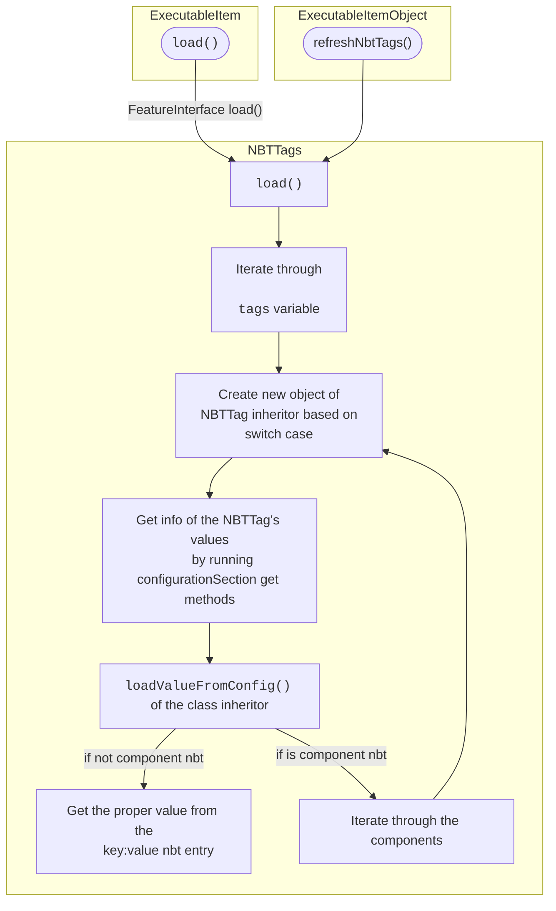
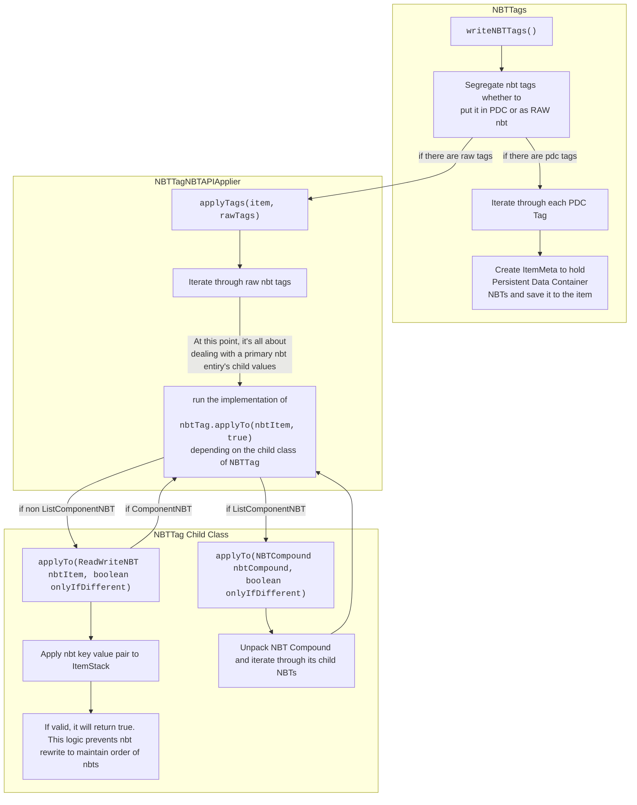

# Processing NBT To Items


## Package Directory

- `com.ssomar.score.features.custom.nbttags`
- `src/main/java/com/ssomar/score/features/custom/nbttags`

## From NBT Ingame Editor To EI Config

When you enter a valid field to the ingame editor,  


First, let's analyze what datatype is used to enter a nbt set. For example, the index 0 is a `STRING`. That means
we have to go to `com.ssomar.score.features.custom.nbttags.StringNBTTag`

<hr/>

Then this gets executed: `com.ssomar.score.features.custom.nbttags.StringNBTTag#loadValueFromConfig`.  
What this does is that it grabs the values from the editor and save it to the instance variable.
```java
    @Override
    public void loadValueFromConfig(ConfigurationSection configurationSection) {
        this.valueString = configurationSection.getString("value", "");
    }
```

:::warning
As of this writing, I have no clue where this value is coming from, but the values from the ingame editor always seem to 
save as `String` so for proper handling of `Integer` and `Double` datatypes, methods are advised to be used.  

Also the method above seems to run first before the constructor despite the load() method below running first.
:::
<br/><br/>

As well as this: `com.ssomar.score.features.custom.nbttags.NBTTags#load(com.ssomar.score.splugin.SPlugin, org.bukkit.configuration.ConfigurationSection, boolean)`
```java
    public List<String> load(SPlugin sPlugin, ConfigurationSection configurationSection, boolean isPremiumLoading) {
        tags.clear();
        ArrayList<String> error = new ArrayList<>();
        if (configurationSection.contains("nbt"))
            if (!isPremiumLoading && isRequirePremium()) {
                error.add(StringConverter.coloredString("&cREQUIRE PREMIUM: to edit NBT you need the premium version"));
            } else {
                ConfigurationSection nbtSection = configurationSection.getConfigurationSection("nbt");
                //SsomarDev.testMsg(" >>>>>>> nbtSection: " + nbtSection, true);
                for (String nbtId : nbtSection.getKeys(false)) {
                    ConfigurationSection tagSection = nbtSection.getConfigurationSection(nbtId);
                    String type = tagSection.getString("type").toUpperCase();
                    String key = tagSection.getString("key");
                    //SsomarDev.testMsg(" >>>>>>> tag type: " + type+" key: "+ key, true);
                    NBTTag tag = null;
                    switch (type) {
                        case "BOOLEAN":
                        case "BOOL":
                            tag = new BooleanNBTTag(tagSection);
                            break;
                        case "STRING":
                        case "STR":
                            tag = new StringNBTTag(tagSection);
                            break;
                        case "DOUBLE":
                            tag = new DoubleNBTTag(tagSection);
                            break;
                        case "INTEGER":
                        case "INT":
                            tag = new IntNBTTag(tagSection);
                            break;
                        case "BYTE":
                            tag = new ByteNBTTag(tagSection);
                            break;
                        case "COMPOUND":
                            tag = new CompoundNBTTag(tagSection);
                            break;
                        case "STRING_LIST":
                            tag = new ListStringNBTTag(tagSection);
                            break;
                        case "COMPOUND_LIST":
                            tag = new ListCompoundNBTTag(tagSection);
                            break;
                        default:
                            error.add("&cInvalid nbt type for the nbt with the id: " + nbtId + ", look the wiki !");
                            continue;
                    }
                    tags.add(tag);
                }
            }
        return error;
    }
```

:::warning
For some reason, configuration values obtained from the ingame editor are **saved as strings**. Further digging through the 
code is required to properly analyze the logic flow
:::
  
  
## From Held Item to EI Config via /ei create

Method: `com.ssomar.score.features.custom.nbttags.NBTTags#load(org.bukkit.inventory.ItemStack)`
Used By: `com.ssomar.executableitems.executableitems.ItemStackToExecutableItemConverter#convert`
```java

    public void load(ItemStack item) {
        if (SCore.hasNBTAPI) {
            NBTItem nbti = new NBTItem(item);
            SsomarDev.testMsg(" >>>>>>> load nbt tags of item: " + item.getType(), true);

            for(String s : nbti.getKeys()) {
                if (blackListedTags().contains(s)) {
                    SsomarDev.testMsg(" >>>>>>> blacklisted tag: " + s, true);
                } else {
                    NBTType type = nbti.getType(s);
                    SsomarDev.testMsg(" >>>>>>> load tag: " + s + " type: " + type, true);
                    switch (type) {
                        case NBTTagString:
                            this.tags.add(new StringNBTTag(s, nbti.getString(s)));
                            break;
                        case NBTTagInt:
                            this.tags.add(new IntNBTTag(s, nbti.getInteger(s)));
                            break;
                        case NBTTagByte:
                            this.tags.add(new ByteNBTTag(s, nbti.getByte(s)));
                            break;
                        case NBTTagCompound:
                            this.tags.add(new CompoundNBTTag(s, nbti.getCompound(s)));
                            break;
                        case NBTTagDouble:
                            this.tags.add(new DoubleNBTTag(s, nbti.getDouble(s)));
                            break;
                        case NBTTagList:
                            switch (nbti.getListType(s)) {
                                case NBTTagString:
                                    this.tags.add(new ListStringNBTTag(s, nbti.getStringList(s)));
                                    break;
                                default:
                                    this.tags.add(new ListCompoundNBTTag(s, nbti.getCompoundList(s)));
                            }
                    }
                }
            }
        }

    }
```

<hr/>

## Preparing NBT from EI Config to be applied to ItemStack

This section is for showing you what's responsible for obtaining nbt details from an ExecutableItem's yml file and
preparing it as a PDC or not.  
:::info  
### Keywords for search
#### how nbt is written
#### assemble nbt for ei
  
Other Resources: https://www.spigotmc.org/threads/are-persistentdatacontainers-and-nbt-tags-the-same.612958/
:::  

### ⚙ Loading NBT Details from Item Configs to Memory
Classes:  
- `com.ssomar.executableitems.executableitems.ExecutableItemObject#refreshNbtTags`
- `com.ssomar.score.features.custom.nbttags.NBTTags#load(com.ssomar.score.splugin.SPlugin, org.bukkit.configuration.ConfigurationSection, boolean)`
- `com.ssomar.executableitems.executableitems.ExecutableItem`
 


### ⚙ Writing NBT To Items  
- Used by ExecutableItems at `com.ssomar.executableitems.executableitems.ExecutableItemObject#refreshNbtTags`

References:
- `com.ssomar.score.features.custom.nbttags.NBTTags#writeNBTTags`  
- `com.ssomar.score.features.custom.nbttags.NBTTagNBTAPIApplier#applyTags`
  
```java
    public ItemStack writeNBTTags(ItemStack item) {
        if (tags.isEmpty()) return item;

        // Separate tags that should go into the Persistent Data Container from
        // those that should remain as raw NBT.  PDC is only available on 1.14+
        // (i.e. !is1v13Less()), so on older versions every tag is treated as
        // raw NBT regardless of the saveInPDC flag.
        List<NBTTag> pdcTags = new ArrayList<>();
        List<NBTTag> rawTags = new ArrayList<>();

        for (NBTTag tag : tags) {
            if (tag.isSaveInPDC() && !SCore.is1v13Less()) {
                if (tag instanceof CompoundNBTTag || tag instanceof ListCompoundNBTTag) {
                    SCore.plugin.getLogger().warning(
                            "[ExecutableItems] NBT tag '" + tag.getKey() +
                            "' has saveInPDC:true but its type (COMPOUND/COMPOUND_LIST) " +
                            "cannot be stored in the Persistent Data Container. " +
                            "The tag will be written as raw NBT instead.");
                    rawTags.add(tag);
                } else {
                    pdcTags.add(tag);
                }
            } else {
                rawTags.add(tag);
            }
        }

        // Write raw NBT tags via NBT-API (existing behaviour).
        // The actual NBT.modify() call lives in NBTTagNBTAPIApplier so that
        // this class never directly references ReadWriteNBT and can be loaded
        // even when the NBT-API plugin is absent.
        if (!rawTags.isEmpty() && SCore.hasNBTAPI) {
            NBTTagNBTAPIApplier.applyTags(item, rawTags);
        }

        // Write PDC tags via Bukkit's PersistentDataContainer
        if (!pdcTags.isEmpty()) {
            ItemMeta meta = item.getItemMeta();
            if (meta != null) {
                PersistentDataContainer pdc = meta.getPersistentDataContainer();
                for (NBTTag tag : pdcTags) {
                    NamespacedKey nsKey = new NamespacedKey(ExecutableItems.getPluginSt(), tag.getKey());
                    if (tag instanceof StringNBTTag) {
                        pdc.set(nsKey, PersistentDataType.STRING, ((StringNBTTag) tag).getValueString());
                    } else if (tag instanceof IntNBTTag) {
                        pdc.set(nsKey, PersistentDataType.INTEGER, ((IntNBTTag) tag).getValueInt());
                    } else if (tag instanceof DoubleNBTTag) {
                        pdc.set(nsKey, PersistentDataType.DOUBLE, ((DoubleNBTTag) tag).getValueDouble());
                    } else if (tag instanceof BooleanNBTTag) {
                        // PDC has no dedicated boolean type; store as BYTE (0/1)
                        pdc.set(nsKey, PersistentDataType.BYTE,
                                ((BooleanNBTTag) tag).isValueBoolean() ? (byte) 1 : (byte) 0);
                    } else if (tag instanceof ByteNBTTag) {
                        pdc.set(nsKey, PersistentDataType.BYTE, ((ByteNBTTag) tag).getValueByte());
                    } else if (tag instanceof ListStringNBTTag) {
                        List<String> list = ((ListStringNBTTag) tag).getValue();
                        pdc.set(nsKey, PersistentDataType.STRING, list.toString());
                    }
                }
                item.setItemMeta(meta);
            }
        }

        return item;
    }
```

