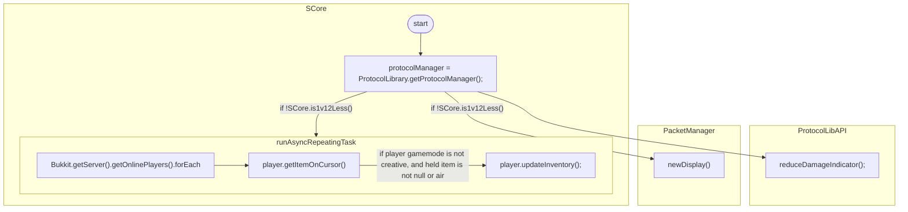

# ProtocolLib API Usage

## SCore.loadDependency()

```mermaid
flowchart TD
    subgraph SCore
        SCore_start(["start"])
        SCore_getProtocolManager["protocolManager = ProtocolLibrary.getProtocolManager();"]

        subgraph runAsyncRepeatingTask
            BukkitForEach["Bukkit.getServer().getOnlinePlayers().forEach"]
            GetItemOnCursor["player.getItemOnCursor()"]
            PlayerUpdateInventory["player.updateInventory();"]
        end
    end

    subgraph ProtocolLibAPI
        ProtocolLibAPI_reduceDamageIndicator["reduceDamageIndicator();"]
    end

    subgraph PacketManager
        PacketManager_newDisplay["newDisplay()"]
    end

    SCore_start --> SCore_getProtocolManager
    SCore_getProtocolManager --> ProtocolLibAPI_reduceDamageIndicator

    SCore_getProtocolManager -- "if !SCore.is1v12Less()" --> PacketManager_newDisplay
    SCore_getProtocolManager -- "if !SCore.is1v12Less()" --> runAsyncRepeatingTask

    BukkitForEach --> GetItemOnCursor
    GetItemOnCursor -- "if player gamemode is not creative, and held item is not null or air" --> PlayerUpdateInventory
```

## Method calls towards Display