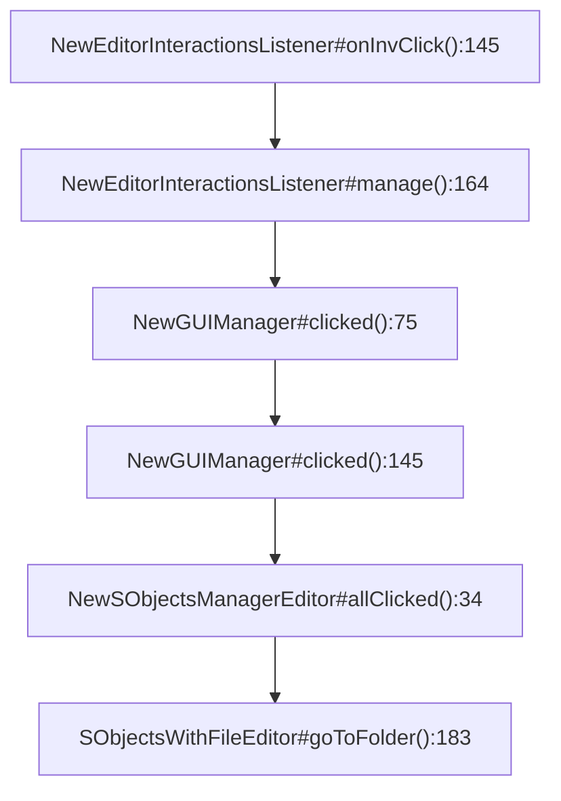

# When Clicking An Icon In The GUI

- First box has `InventoryClickEvent` @EventHandler

```mermaid
---
config:
  flowchart:
    htmlLabels: false
---
flowchart TD
    1["NewEditorInteractionsListener#onInvClick():145"]
    2["NewEditorInteractionsListener#manage():164"]
    3["NewGUIManager#clicked():75"]
    4["NewGUIManager#clicked():145"]
    5["NewSObjectsManagerEditor#allClicked():34"]
    6["SObjectsWithFileEditor#goToFolder():183"]
    
    1-->2
    2-->3
    3-->4
    4-->5
    5-->6
```