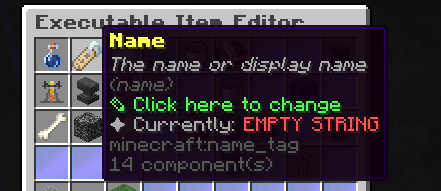

# How to add custom FeatureSettingsSCore value?

If you may have noticed, this enum shows up quite frequently across the codebase. If you want to know the purpose of these enums,
this is the place for you to know why.

These enums make up the basic material, name and lore of an icon.



Sometimes, due to the Feature class that's using this feature setting enum, the ItemStack icon's lore has more lore lines than what's written in its configuration.

Let's start learning how to create a custom `FeatureSettingsSCore` value.

## 1) Create a custom enum in `com.ssomar.score.features.FeatureSettingsSCore`

```java

    suspiciousBlockLoot(getFeatureSettings("suspiciousBlockLoot")),
    papiParser(getFeatureSettings("papiParser"))
```
Read how the enums are written in this enum file. Just follow how the rest are written.  
Example: `applyEffects(getFeatureSettings("applyEffects"))`

(Couldn't be bothered to check the purpose of SavingVerbosity argument -Special70)

## 2) Create a custom enum at `com.ssomar.score.features.lang.FeatureSettingsSCoreEN`

```java

    suspiciousBlockLoot("suspiciousBlockLoot", "Suspicious Block Loot", new String[]{"&7The loot the ExecutableBlock will have","&7when brushed.","&cREQUIRED BY PLAYER_BRUSH_BLOCK"}, FixedMaterial.getMaterial(Arrays.asList("BRUSH"))),
    papiParser("papiParser", "PlaceholderAPI Parser", new String[]{"&7The text you want to use along with the", "&7variable value in order for it to work", "&7with PlaceholderAPI placeholders.", "", "&7Check wiki for further details"}, FixedMaterial.getMaterial(Arrays.asList("LEAD", "LEASH")))
```
Same process as Step 1. Follow how the previous enums are written but make sure the string your custom enum at `FeatureSettingsSCore` is properly referencing the enum you made here at `FeatureSettingsSCoreEN`.

<hr/>

That's it. You can now use your custom FeatureSettingsSCore like: `FeatureSettingsSCore.papiParser`
