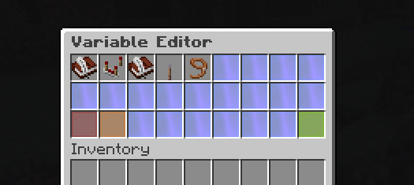
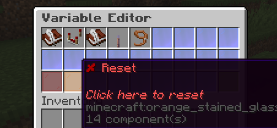
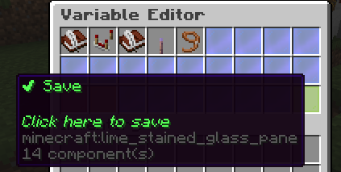
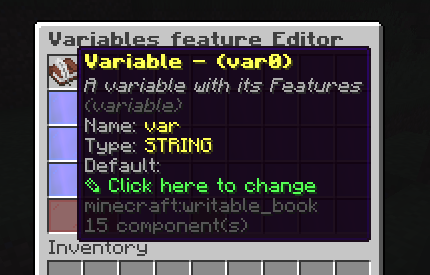

# How to create/modify Feature Editors?
<hr/>
- Can be known as,
    - **How to create a feature editor class**

<hr/>

> This guide may serve as reference for modifying or creating new editors.

> In SPlugins, some item features come in a bundle of other settings due to their complexity. One of them is the Variables Editor.
> Most of the time, the code responsible is located at the `SCore` plugin. 
> 
> If you want to find its class editor, use CTRL+SHIFT+F (in windows) to open `Find in files` and check its declared variables if
> their names match the ones in the ingame editor.
> 
> `SPlugins` does not have a very complete code documentation so you have to find what you need in the hard way for now.




> For this example, the variables editor is located in `com.ssomar.score.features.custom.variables.base.variable.VariableFeature`. 
>
> This feature editor will also be used as reference for this tutorial

## How to setup features of a feature editor?
### 1) Declare feature variables

```java

    private UncoloredStringFeature variableName;
    private VariableTypeFeature type;
    private ColoredStringFeature stringValue;
    private DoubleFeature doubleValue;
    private ListColoredStringFeature listValue;
    private String id;

    private BooleanFeature isRefreshableClean;
    private ColoredStringFeature refreshTag;
    private UncoloredStringFeature papiParser;
```
Go to `com.ssomar.score.features.types` and look around which feature you want to use. Afterwards, declare the variables of your selected features as private variables.

These will later be the ones that will form the clickable icons in the Item Variables editor.


### 2) Create the constructor
```java

    public VariableFeature(FeatureParentInterface parent, String id) {
        super(parent, FeatureSettingsSCore.variable);
        this.id = id;
        reset();
    }
```
For FeatureSettingsSCore value, refer to [this page about adding custom FeatureSettingsSCore enums](./how_to_add_custom_FeatureSettingsCore_value.md)

### 3) Setup the override method code
The code below are samples from VariableFeature class

<hr/>

#### reset()
> This gets executed if the user presses the reset button  


```java
    @Override
    public void reset() {
        this.variableName = new UncoloredStringFeature(this, Optional.of("var"), FeatureSettingsSCore.variableName, false);
        this.type = new VariableTypeFeature(this, Optional.of(VariableType.STRING), FeatureSettingsSCore.type, false);
        this.stringValue = new ColoredStringFeature(this, Optional.of(""), FeatureSettingsSCore.default_string);
        this.doubleValue = new DoubleFeature(this, Optional.of(0.0), FeatureSettingsSCore.default_double);
        this.listValue = new ListColoredStringFeature(this,  new ArrayList<>(), FeatureSettingsSCore.default_list, Optional.empty());
        this.isRefreshableClean = new BooleanFeature(this, false, FeatureSettingsSCore.isRefreshableClean);
        this.refreshTag = new ColoredStringFeature(this, Optional.of(""), FeatureSettingsSCore.refreshTag);
        this.papiParser = new UncoloredStringFeature(this, Optional.of(""), FeatureSettingsSCore.papiParser, true);

    }
```

<hr/>

#### save()

> This gets executed if the user presses the save button


```java
    @Override
    public void save(ConfigurationSection config) {
        config.set(id, null);
        ConfigurationSection attributeConfig = config.createSection(id);
        this.variableName.save(attributeConfig);
        this.type.save(attributeConfig);
        if (type.getValue().get().equals(VariableType.STRING)) {
            this.stringValue.save(attributeConfig);
        } else if (type.getValue().get().equals(VariableType.LIST)) {
            this.listValue.save(attributeConfig);
        }
        else {
            this.doubleValue.save(attributeConfig);
        }
        this.isRefreshableClean.save(attributeConfig);
        this.refreshTag.save(attributeConfig);
        this.papiParser.save(attributeConfig);
    }
```
<hr/>

#### reload()

> This gets executed upon plugin reload 

```java

    @Override
    public void reload() {
        for (FeatureInterface feature : (List<FeatureInterface>) getParent().getFeatures()) {
            if (feature instanceof VariableFeature) {
                VariableFeature aFOF = (VariableFeature) feature;
                if (aFOF.getId().equals(id)) {
                    aFOF.setVariableName(variableName);
                    aFOF.setType(type);
                    aFOF.setStringValue(stringValue);
                    aFOF.setDoubleValue(doubleValue);
                    aFOF.setListValue(listValue);
                    aFOF.setIsRefreshableClean(isRefreshableClean);
                    aFOF.setRefreshTag(refreshTag);
                    if(isRefreshableClean.getValue() && refreshTag.getValue().get().isEmpty()) {
                        refreshTag.setValue(generateTag());
                    }
                    aFOF.setPapiParser(papiParser);
                    break;
                }
            }
        }
    }
```

<hr/>

#### initItemParentEditor()

This forms the clickable ItemStack that leads the user to its editor



```java

    @Override
    public VariableFeature initItemParentEditor(GUI gui, int slot) {
        String[] finalDescription = new String[getEditorDescription().length + 4];
        System.arraycopy(getEditorDescription(), 0, finalDescription, 0, getEditorDescription().length);
        finalDescription[finalDescription.length - 4] = "&7Name: &e" + variableName.getValue().get();
        finalDescription[finalDescription.length - 3] = "&7Type: &e" + type.getValue().get();
        if (type.getValue().get().equals(VariableType.STRING))
            finalDescription[finalDescription.length - 2] = "&7Default: &e" + stringValue.getValue().get();
        else if (type.getValue().get().equals(VariableType.LIST))
            finalDescription[finalDescription.length - 2] = "&7Default: &e" + Arrays.toString(listValue.getValue().toArray());
        else finalDescription[finalDescription.length - 2] = "&7Default: &e" + doubleValue.getValue().get();
        finalDescription[finalDescription.length - 1] = GUI.CLICK_HERE_TO_CHANGE;

        gui.createItem(getEditorMaterial(), 1, slot, GUI.TITLE_COLOR + getEditorName() + " - " + "(" + id + ")", false, false, finalDescription);
        return this;
    }
``` 

<hr/>


#### clone()

No clue how and when this is used. Still implement it like how it's done in other feature classes.  
(VERIFY LATER) If the feature editor contains another feature editor, don't include it in this override method

```java

    @Override
    public VariableFeature clone(FeatureParentInterface parent) {
        VariableFeature eF = new VariableFeature(parent, id);
        eF.setVariableName(variableName.clone(eF));
        eF.setType(type.clone(eF));
        eF.setStringValue(stringValue.clone(eF));
        eF.setDoubleValue(doubleValue.clone(eF));
        eF.setListValue(listValue.clone(eF));
        eF.setIsRefreshableClean(isRefreshableClean.clone(eF));
        eF.setRefreshTag(refreshTag.clone(eF));
        eF.setPapiParser(papiParser.clone(eF));
        return eF;
    }
```

<hr/>

#### load()

Is executed upon server and plugin load

```java

    @Override
    public List<String> load(SPlugin plugin, ConfigurationSection config, boolean isPremiumLoading) {
        List<String> errors = new ArrayList<>();
        if (config.isConfigurationSection(id)) {
            ConfigurationSection enchantmentConfig = config.getConfigurationSection(id);
            errors.addAll(this.variableName.load(plugin, enchantmentConfig, isPremiumLoading));
            errors.addAll(this.type.load(plugin, enchantmentConfig, isPremiumLoading));
            if (type.getValue().get().equals(VariableType.STRING)) {
                errors.addAll(this.stringValue.load(plugin, enchantmentConfig, isPremiumLoading));
            } else if (type.getValue().get().equals(VariableType.LIST)) {
                errors.addAll(this.listValue.load(plugin, enchantmentConfig, isPremiumLoading));
            } else {
                errors.addAll(this.doubleValue.load(plugin, enchantmentConfig, isPremiumLoading));
            }
            errors.addAll(this.isRefreshableClean.load(plugin, enchantmentConfig, isPremiumLoading));
            errors.addAll(this.refreshTag.load(plugin, enchantmentConfig, isPremiumLoading));
            if(isRefreshableClean.getValue() && refreshTag.getValue().get().isEmpty()) {
               refreshTag.setValue(generateTag());
            }
            this.papiParser.load(plugin, enchantmentConfig, isPremiumLoading);
        } else {
            errors.add("&cERROR, Couldn't load the Variable with its options because there is not section with the good ID: " + id + " &7&o" + getParent().getParentInfo());
        }
        return errors;
    }
```

<hr/>

#### getFeatures()

Properly adds the declared feature variables to the feature editor. If you're curious to how the ItemStack of a `Feature Type` is made,
go read the page of [ItemsAdderFeature](../library_tools/feature_parent_interface/FeatureAbstract/ItemsAdderFeature.md) for reference.

```java

    @Override
    public List<FeatureInterface> getFeatures() {
        List<FeatureInterface> featureInterfaces =  new ArrayList<>(Arrays.asList(variableName, type));
        if (type.getValue().get().equals(VariableType.STRING)) {
            featureInterfaces.add(stringValue);
        } else if (type.getValue().get().equals(VariableType.LIST)) {
            featureInterfaces.add(listValue);
        } else {
            featureInterfaces.add(doubleValue);
        }
        featureInterfaces.add(isRefreshableClean);
        featureInterfaces.add(papiParser);
        return featureInterfaces;
    }
```

<hr/>

#### Others

```java

    @Override
    public void openBackEditor(@NotNull Player player) {
        getParent().openEditor(player);
    }

    @Override
    public void openEditor(@NotNull Player player) {
        GenericFeatureParentEditorReloadedManager.getInstance().startEditing(player, this);
    }
    
    @Override
    public String getParentInfo() {
        return getParent().getParentInfo();
    }

    @Override
    public ConfigurationSection getConfigurationSection() {
        return getParent().getConfigurationSection();
    }

    @Override
    public File getFile() {
        return getParent().getFile();
    }

    @Override
    public void updateItemParentEditor(GUI gui) {

    }
    
    @Override
    public VariableFeature getValue() {
        return this;
    }
    
    @Override
    public boolean isTheFeatureClickedParentEditor(String featureClicked) {
        return featureClicked.contains(getEditorName()) && featureClicked.contains("(" + id + ")");
    }
```

### Sample Application/Usage

Finally, this class is ready for usage. Let's see how it's used practically

#### Ingame Editor
- Couldn't find where and how it's used so it gets rendered in EI/EB variables editor

#### Utilizing feature values
Class: `com.ssomar.executableitems.executableitems.ExecutableItemObject`

```java

        for (VariableFeature vC : config.getVariables().getVariables().values()) {
            internalData.getVariableRealsList().add(VariableRealBuilder.build(vC, item, dMeta).get());
            // It doesnt init variables on the item, it just read them
            // editedMeta = true;
        }
```

### Sample Class File

This was made and then scrapped during development. But this is what a functioning Features editor looks like

```java
@Getter
@Setter
public class OnConsumeEffectsFeatures extends FeatureWithHisOwnEditor<OnConsumeEffectsFeatures, OnConsumeEffectsFeatures, GenericFeatureParentEditor, GenericFeatureParentEditorManager> implements FeatureForItemNewPaperComponents {

    private BooleanFeature clearAllEffects;
    private ListPotionEffectTypeFeature listPotionEffectTypeToRemove;


    public OnConsumeEffectsFeatures(FeatureParentInterface parent, FeatureSettingsInterface featureSettingsSCore) {
        super(parent, featureSettingsSCore);
        reset();
    }

    public OnConsumeEffectsFeatures(FeatureParentInterface parent) {
        super(parent, FeatureSettingsSCore.onConsumeEffects);
        reset();
    }


    @Override
    public List<FeatureInterface> getFeatures() {
        List<FeatureInterface> features = new ArrayList<>();
        features.add(clearAllEffects);
        features.add(listPotionEffectTypeToRemove);
        return features;
    }

    @Override
    public String getParentInfo() {
        return getParent().getParentInfo();
    }

    @Override
    public ConfigurationSection getConfigurationSection() {
        return getParent().getConfigurationSection();
    }

    @Override
    public File getFile() {
        return getParent().getFile();
    }

    @Override
    public void reload() {
        for (FeatureInterface feature : (List<FeatureInterface>) getParent().getFeatures()) {
            if (feature instanceof OnConsumeEffectsFeatures) {
                OnConsumeEffectsFeatures hiders = (OnConsumeEffectsFeatures) feature;
                hiders.setClearAllEffects(clearAllEffects);
                hiders.setListPotionEffectTypeToRemove(listPotionEffectTypeToRemove);
            }
        }
    }

    @Override
    public void openEditor(@NotNull Player player) {
        GenericFeatureParentEditorManager.getInstance().startEditing(player, this);
    }

    @Override
    public void openBackEditor(@NotNull Player player) {
        getParent().openEditor(player);

    }

    @Override
    public List<String> load(SPlugin plugin, ConfigurationSection config, boolean isPremiumLoading) {
        List<String> errors = new ArrayList<>();
        if (config.isConfigurationSection(getName())) {
            ConfigurationSection section = config.getConfigurationSection(getName());
            errors.addAll(this.clearAllEffects.load(plugin, section, isPremiumLoading));
            errors.addAll(this.listPotionEffectTypeToRemove.load(plugin, section, isPremiumLoading));

        }
        return errors;
    }

    @Override
    public void save(ConfigurationSection config) {
        config.set(getName(), null);
        ConfigurationSection section = config.createSection(getName());
        this.clearAllEffects.save(section);
        this.listPotionEffectTypeToRemove.save(section);
        if(isSavingOnlyIfDiffDefault() && section.getKeys(false).isEmpty()){
            config.set(getName(), null);
            return;
        }

        if (GeneralConfig.getInstance().isEnableCommentsInConfig())
            config.setComments(this.getName(), StringConverter.decoloredString(Arrays.asList(getFeatureSettings().getEditorDescriptionBrut())));
    }

    @Override
    public OnConsumeEffectsFeatures getValue() {
        return this;
    }

    @Override
    public OnConsumeEffectsFeatures initItemParentEditor(GUI gui, int slot) {
        int len = 3;
        String[] finalDescription = new String[getEditorDescription().length + len];
        System.arraycopy(getEditorDescription(), 0, finalDescription, 0, getEditorDescription().length);
        finalDescription[finalDescription.length - len] = GUI.CLICK_HERE_TO_CHANGE;
        len--;
        if (clearAllEffects.getValue())
            finalDescription[finalDescription.length - len] = "&7clearAllEffects: &a&l✔";
        else
            finalDescription[finalDescription.length - len] = "&7clearAllEffects: &c&l✘";
        len--;
        if (!listPotionEffectTypeToRemove.getValue().isEmpty())
            finalDescription[finalDescription.length - len] = "&7Enabled: &a&l✔";
        else
            finalDescription[finalDescription.length - len] = "&7Disabled: &c&l✘";
        gui.createItem(getEditorMaterial(), 1, slot, GUI.TITLE_COLOR + getEditorName(), false, false, finalDescription);
        return this;
    }

    @Override
    public void updateItemParentEditor(GUI gui) {

    }

    @Override
    public void reset() {
        clearAllEffects = new BooleanFeature(this, false, FeatureSettingsSCore.clearAllEffects);
        listPotionEffectTypeToRemove = new ListPotionEffectTypeFeature(this, new ArrayList<>(),FeatureSettingsSCore.listPotionEffectTypeToRemove);
    }

    @Override
    public OnConsumeEffectsFeatures clone(FeatureParentInterface newParent) {
        OnConsumeEffectsFeatures dropFeatures = new OnConsumeEffectsFeatures(newParent);
        dropFeatures.clearAllEffects = clearAllEffects.clone(dropFeatures);
        dropFeatures.listPotionEffectTypeToRemove = listPotionEffectTypeToRemove.clone(dropFeatures);
        return dropFeatures;
    }

    @Override
    public void applyOnItem(@NotNull FeatureForItemArgs args) {
        // nothing for now. busy dealing with other features
    }

    @Override
    public void loadFromItem(@NotNull FeatureForItemArgs args) {
        // nothing for now. busy dealing with other features
    }

    @Override
    public boolean isAvailable() {
        return SCore.is1v21v4Plus() && SCore.isPaperOrFork();
    }

    @Override
    public boolean isApplicable(@NotNull FeatureForItemArgs args) {
        return true;
    }

    @Override
    public void applyOnItemMeta(@NotNull FeatureForItemArgs args) {}

    @Override
    public void loadFromItemMeta(@NotNull FeatureForItemArgs args) {}

    @Override
    public ResetSetting getResetSetting() {
        return ResetSetting.CONSUMABLE;
    }
}
```