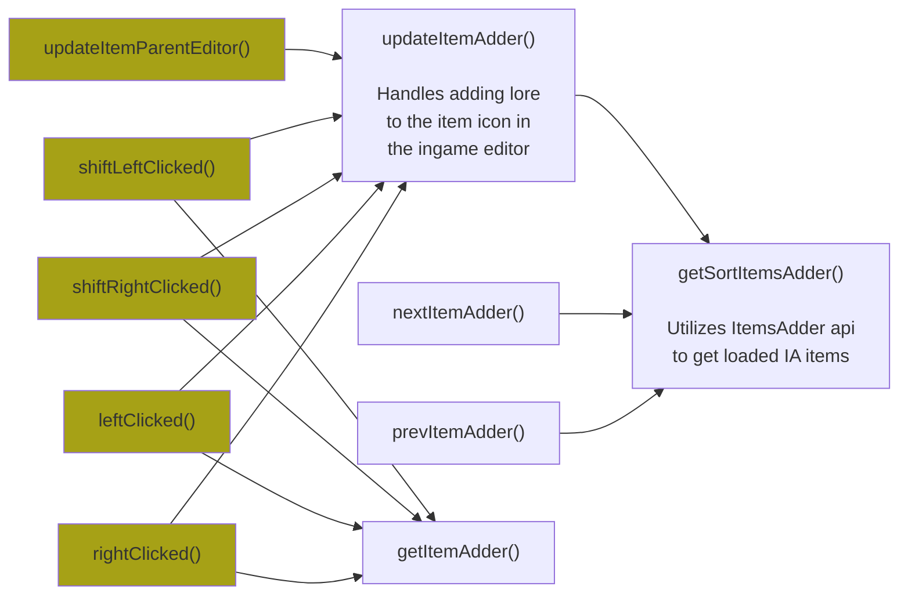
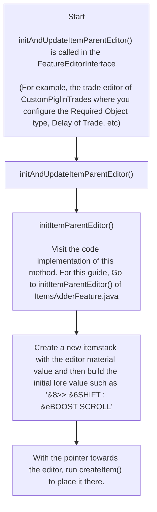

# ItemsAdderFeature

> For now, this will be the reference to be used when studying FeatureAbstract classes. Don't think I have to write one page per these
> if you can just reverse engineer the others after understanding how this one works
> 
> - Special70

## Connections of Child Methods
- Yellow nodes are overrides of the parent class

## Deployment of the feature's itemstack to an editor

